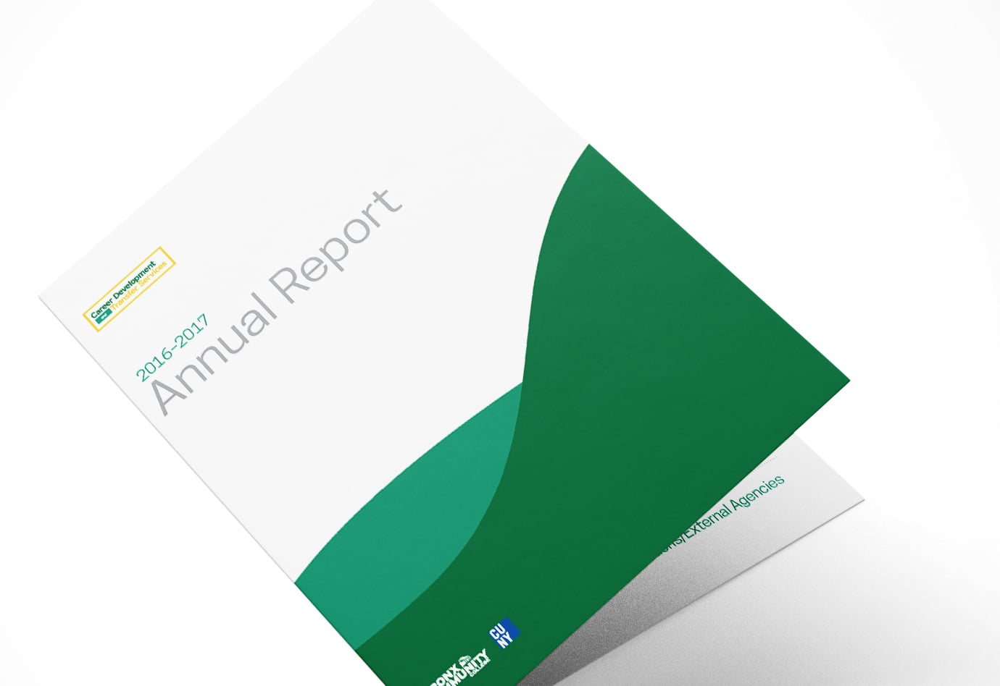

<projecttext>
  
Mobile Friendly Tickets at your fingertips.

  
Doing most of their marketing through social, having a website optimized for mobile is crucial. Beauty and ease of use on every screen was a priority

</projecttext>

<figure></figure>
<figure></figure>
<figure></figure>
<figure></figure>
<figure></figure>
<figure></figure>
<figure></figure>
<figure></figure>
<figure></figure>

