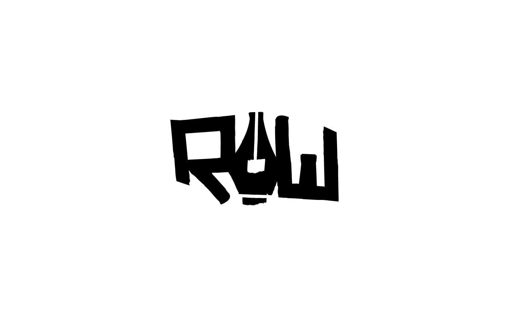
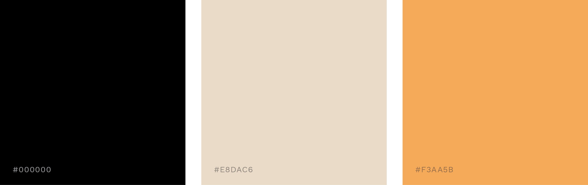
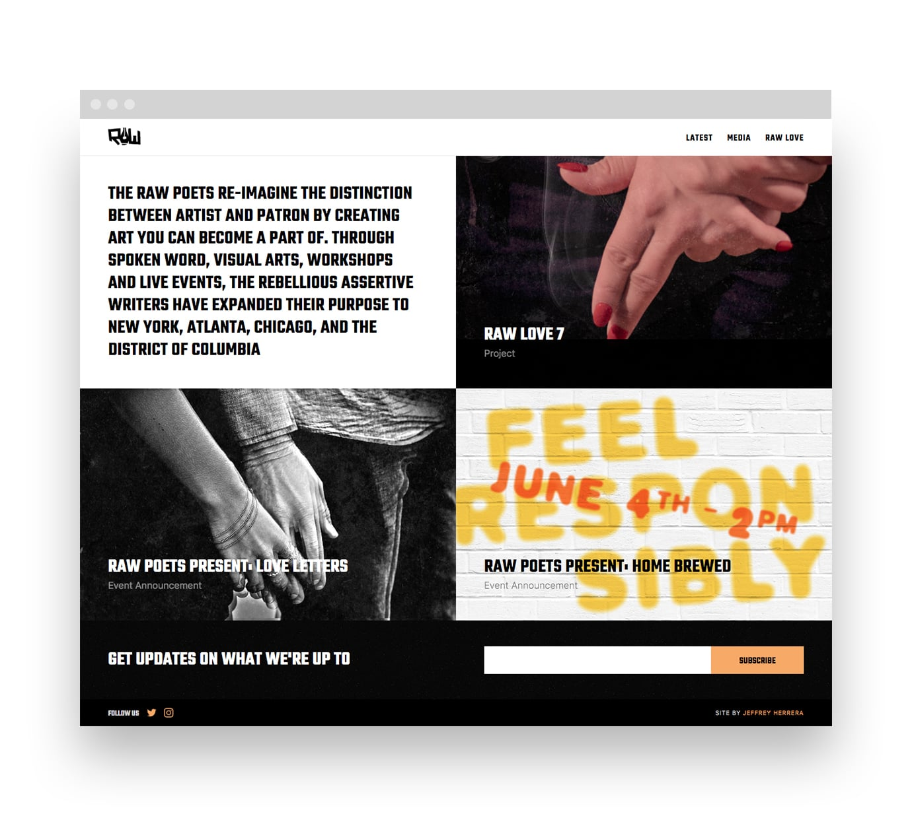
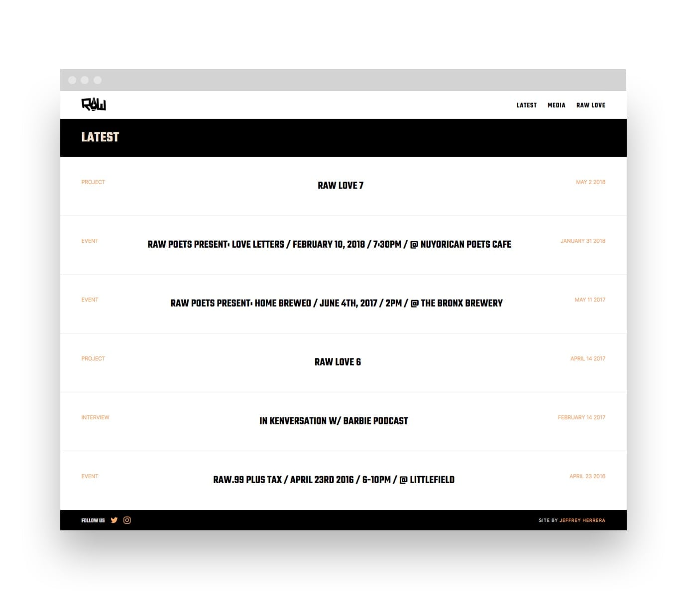
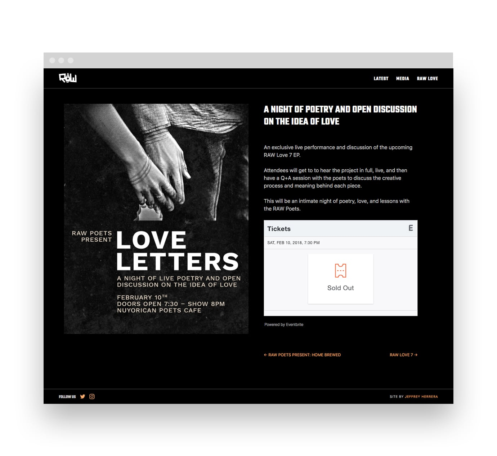
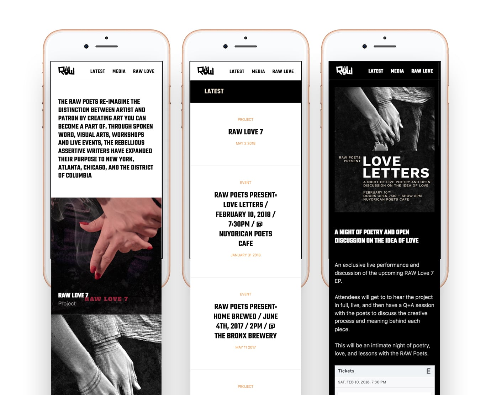

<projecttext>
  
The Challenge Branding self expression.

  
<a href="https://www.rawpoets.com">The Raw Poets</a> are a poetry collective based in New York City. The acronym stands for Rebellious Assertive Writers, which best describes the group’s dynamic. I set out to design an identity that represents the group’s unique take on spoken word.
    
  Being a group of writers first, the pen serves as an icon for these wordsmiths.

</projecttext>

<figure></figure>

<figure></figure>

<projecttext>
  
What's in a brand? The RAW Poets ethos

  
The brand focuses on juxstaposing clean minimalism &amp; grit. With every promotional image, we aim to delight visually, but keep typography clean and prominent. Designing for a poetry group– we've got to respect words.

</projecttext>

<figure></figure>

<figure></figure>

<figure></figure>

<projecttext>
  
Mobile Friendly Tickets at your fingertips.

  
Doing most of their marketing through social, having a website optimized for mobile is crucial. Beauty and ease of use on every screen was a priority

</projecttext>

<figure></figure>
<figure></figure>